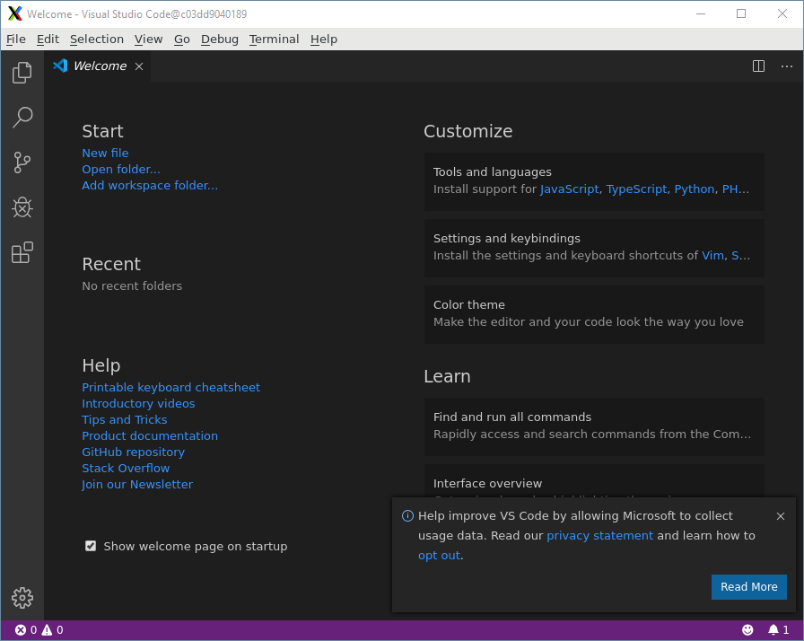

# Default template for using Containers as a workspace

## Docker and Docker-Compose uses .env filen:
COMPOSE_CONVERT_WINDOWS_PATHS=1
    - makes it possible to share Sockets on Windows    
COMPOSE_PROJECT_NAME=<name>_<id> i.e "template-workspace-remote-ssh"
    - overrides the default name of the compose project name so that the name of the network becomes unique

## Image

